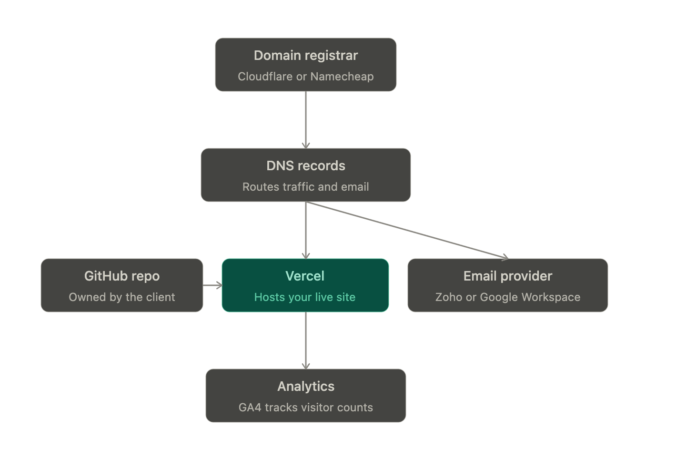

# Whose name goes on the accounts?
This answers three of your questions at once (domain, GitHub, hosting). One rule covers all of it: every account — domain registrar, GitHub, Vercel, email provider — should be owned by the client, not you. You get added as a collaborator/admin on each.

Why: if you register everything under your own personal logins "to move fast," the client doesn't actually control their own business. If the arrangement ends badly, or you're just unreachable for a few weeks, they're locked out of their own site and inbox. This is the single most common thing freelancers get burned on later. Cleanest approach: have the client create each account (or you create them using the client's email + card) from day one, and you get invited in as collaborator/team member/admin. If you need to move fast and set things up under your own account first, transfer ownership before go-live, not after you've been paid.

Here's how the pieces connect, so the rest of this makes sense as you go:

Now let's walk through each piece.
# 1. Pick the tech stack first: Next.js, not plain React
Since SEO is explicitly a goal, this decision matters more than it looks. Plain React (Create React App/Vite) ships an almost-empty HTML file — the page fills in only after JavaScript runs, which historically hurts how fast and reliably search engines and link-preview bots (WhatsApp, Facebook) read your content. Next.js pre-builds pages as real HTML (Static Site Generation), so content and meta tags are already there on load — directly helpful for both SEO and social share previews, which matter a lot for word-of-mouth in India.
Practical reasons on top of that:

It deploys to Vercel with zero configuration (Vercel built Next.js).
Its Metadata API sets per-page titles/descriptions cleanly, and it can auto-generate sitemap.xml and robots.txt.
It gives you room to grow — a contact form via API routes, a blog, maybe a client login later — without a rebuild.

Pair it with Tailwind CSS for styling — standard combination, fast to build with. (If you want an even leaner, zero-JS option for a pure brochure site, Astro is worth knowing about — but Next.js is the safer default given you'll likely add a form and a blog.)

# 2. Buy the domain
Picking the name: short, easy to say over the phone (people will literally read it aloud or type it from memory), and it should signal what it is — a variant on "tax," "ITR," or the consultant's own name/brand. Avoid hyphens and numbers.
.com vs .in: .com is the safer universal default. .in is fine too, and cheap enough (~$10-13/year, same ballpark as .com) that many people just buy both and redirect the one they're not using to the primary one.
Where to register — I checked current pricing since registrars change often:

Cloudflare Registrar: sells at wholesale cost with no markup — a .com runs about $10-10.50/year, and that price stays the same at renewal instead of jumping up like most registrars. Downside: you need a Cloudflare account first, and it's a bit more technical for a first-timer. WhatPeopleUse
Namecheap: the most beginner-friendly option, live chat support, clean dashboard. First-year promo pricing is attractive, but renewal is noticeably higher than the discounted first-year rate — budget around $13-14/year from year two onward. DomainWheel
Avoid GoDaddy if you can — heavier upselling and renewal pricing runs closer to $20+/year. Godaddis
If the client wants INR billing/local support, Indian registrars (Hostinger India, BigRock) work fine too — Namecheap and Cloudflare both accept Indian cards regardless.

3. Point the DNS
The domain registrar and where your site actually lives are two different things — DNS records are what connect them. Two record types matter here: A/CNAME records point the domain at your hosting (Vercel), and MX records point it at your email provider. Vercel and your email provider will each give you exact values to paste in once you've signed up for them — you don't need to figure these out in advance.
Optional but common practice: point the domain's nameservers at Cloudflare (free account) for one clean DNS dashboard regardless of where you registered, plus some free extras (fast DNS, basic security). Not required — your registrar's built-in DNS panel works fine too — just a nice-to-have if you don't mind one more account.

4. GitHub: create the repo under the client's account
Following the ownership rule above — create the repository under the client's GitHub account (or an organization they own), not yours. If they don't have one, create it for them with their email; it's free and takes two minutes. Then you get added as a Collaborator with write access.
Keep the repo Private — no real downside for a marketing site, and it keeps any API keys or config out of public view. GitHub doesn't charge extra for private repos or for adding collaborators, so ownership doesn't cost anything either way.

5. Deploy: Vercel, not AWS — with one important catch
For a Next.js marketing site, Vercel is the right call over AWS. Setup is: connect the GitHub repo → Vercel auto-detects Next.js → deploy → live URL in about a minute. Every future git push to the main branch auto-redeploys, and every pull request gets its own preview link, which is genuinely useful for showing the client a draft before it goes live. Free SSL and a global CDN come with it. AWS can do the same job (S3 + CloudFront + Route 53 + ACM, or AWS Amplify as the more Vercel-like option), but it means wiring up several services yourself for no real benefit at this traffic scale — worth it only at much larger scale or specific enterprise needs.
The catch, and it's an important one: Vercel's free "Hobby" tier is explicitly restricted to personal, non-commercial projects, and hitting its usage caps doesn't bill you — it just pauses the deployment until the next cycle, no warning. A live client business site doesn't qualify as "personal, non-commercial," so this should go on Vercel Pro — $20 per seat per month, which includes a $20 usage credit and 1TB of bandwidth — under the client's Vercel account, with you added as a team member. That's a real, recurring cost worth telling the client about upfront rather than discovering later when the free tier locks up mid-launch. supadrop + 3
If $20/month feels heavy for a brand-new practice, AWS Amplify Hosting doesn't carry Vercel's non-commercial restriction and can run close to free at low traffic — but you'll trade Vercel's simplicity for more setup.

6. Business email
A tax consultant emailing from contact@clientdomain.com reads as legitimate; the same person emailing from a personal Gmail address reads as amateur at best and scam-adjacent at worst — people are already wary of anything tax-related. Two solid options, both confirmed current:

Zoho Mail — the only genuinely useful free plan with custom-domain support in the market, covering up to 5 users with 5GB storage each on a single domain. The catch: no IMAP/POP access on the free plan, so you're limited to Zoho's own webmail/app rather than Outlook or the native phone mail app — a $1/user/month paid tier removes that limit. For one consultant or a small team, this is genuinely free forever and enough. Ecommerce Paradise + 3
Google Workspace — more recognizable to a client who already lives in Gmail/Docs/Sheets. Indian pricing sits around ₹270/user/month for the Starter plan on an annual commitment, before 18% GST, with an India-only Base plan around ₹99/user/month as the cheapest entry point. Prices vary a fair bit by reseller and intro offers, so check workspace.google.com directly or an authorized Indian reseller for a proper GST invoice. SiriusstarUnico Connect

My default: start with Zoho's free plan unless the client specifically wants the Gmail interface. Setup either way: sign up → verify domain ownership (a TXT record) → add the MX records they give you → create the mailbox (contact@, or the consultant's own name).

7. Analytics: keep it simple, like the client asked

Google Analytics (GA4) — free at any traffic level, no matter how the site grows, and it's the name every business owner already recognizes. Setup: create a GA4 property, get the Measurement ID, drop it into the Next.js app (the @next/third-parties package has a ready-made component for this). For "how many people visited," you'll live in Reports → Realtime and Reports → Engagement, ignoring the rest of the interface.
Vercel Web Analytics — since you're on Vercel anyway, this is a one-click toggle with no extra script, and gives a nice at-a-glance view right next to your deployments. Worth flagging though: it's free only up to 2,500 events a month, while GA4 stays free at essentially any scale — so treat Vercel Analytics as a convenient bonus, not the system of record. Zaid AhmadZaid Ahmad

Turn on both if you like — GA4 for the real numbers, Vercel Analytics for the quick glance.

8. SEO — and the timing here actually matters right now
This business has two traffic engines: local intent ("ITR filing near me," "tax consultant in [city]") and seasonal demand spikes around filing deadlines. Both are worth building around.
Google Business Profile (separate from the website, free): set this up immediately. For a local service business it often drives more calls than the site itself — it's what shows in Google Maps and the local 3-pack. Fill in a real service area, phone number, and category ("Tax Preparation Service"), and get clients to leave Google reviews after filing — reviews are the single biggest local-ranking lever.
On-page basics: a separate page per service (ITR-1/ITR-2 filing, ITR-3/ITR-4 for freelancers and small businesses, GST registration, tax planning) rather than one page trying to rank for everything, each with its own title/description via Next.js's Metadata API. Mobile-first design matters a lot here since most of this search traffic in India is on a phone. Add a sitemap, robots.txt (Next.js generates both natively), and basic Schema.org markup (LocalBusiness, Service, FAQPage) so Google can show rich results.
The timely part — this is worth acting on this week, not "eventually": salaried filers under ITR-1 and ITR-2 have a July 31, 2026 deadline, while freelancers, consultants, and small businesses filing ITR-3 or ITR-4 without an audit requirement got an extension to August 31, 2026. Two things follow from that: TaxFetch

Search interest in "ITR filing last date extension" spiked on Google Trends just this week, and with well over 4 crore returns already filed for ITR-1/ITR-2, a further extension for that group looks unlikely — so don't bank content on that date moving. UpstoxUpstox
The ITR-3/ITR-4 crowd (freelancers, consultants, small business owners — exactly who'd hire a tax consultant) still has a genuine month of high-intent search traffic open. Get 2-3 posts live this week: "ITR-3/ITR-4 deadline extended to August 31" and a plain-language explainer on what happens if someone missed July 31 (belated filing). That's fast-rankable, high-search-volume content while interest is actually peaking.

Beyond this week: build out a content calendar for the full year ahead — advance tax deadlines each quarter, Form 16 season around June, the next filing season opening in April — so the site has a head start on ranking before next year's rush instead of scrambling at the last minute like most competitors do.
Backlinks: listings on JustDial, Sulekha, and IndiaMART, plus a listing from ICAI or a local trade body if the consultant is a practicing CA — these carry real local-SEO weight. Beyond classic search, keeping content clearly structured with direct answers and an FAQ section also helps it get picked up by AI answer engines (Google's AI Overviews, ChatGPT, Perplexity), which are an increasingly real source of visibility alongside blue-link rankings.
Running costs, once it's live
ItemChoiceCostDomainCloudflare/Namecheap, .com~$10-13/yearEmailZoho Mail free plan$0HostingVercel Pro (required for commercial use)$20/month (~₹1,700)AnalyticsGA4$0
Call it roughly $20-25/month plus the yearly domain fee — mostly the Vercel Pro seat. Worth agreeing with the client upfront who covers this ongoing cost versus your one-time build fee.
A few things you didn't ask about but will want

A way to actually convert visitors: a simple contact form (a Next.js API route + a free-tier form service like Web3Forms) so "people are visiting" turns into inquiries.
A WhatsApp click-to-chat button: extremely standard for Indian service businesses and often converts better than a form — just a wa.me link on a floating button.
A short privacy policy page: even a plain contact form collects name/email/phone, which counts as personal data under India's DPDP Act. A basic policy is standard practice and low effort to add.

Quick-reference checklist

Scaffold a Next.js + Tailwind project
Buy the domain (Cloudflare or Namecheap, under the client's account)
Create a private GitHub repo under the client's account, add yourself as collaborator
Connect the repo to Vercel (client's account, Pro plan), point DNS at it
Set up Zoho Mail or Google Workspace, add MX records
Add GA4 (and optionally Vercel Analytics)
Set up Google Business Profile
Publish the timely ITR-3/ITR-4 deadline content this week
Add contact form, WhatsApp button, privacy policy
Hand over all account credentials/ownership to the client in writing